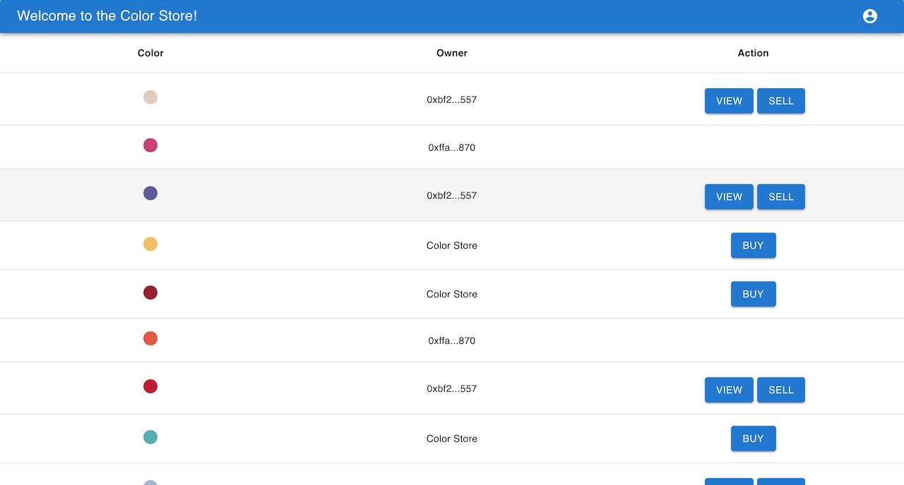
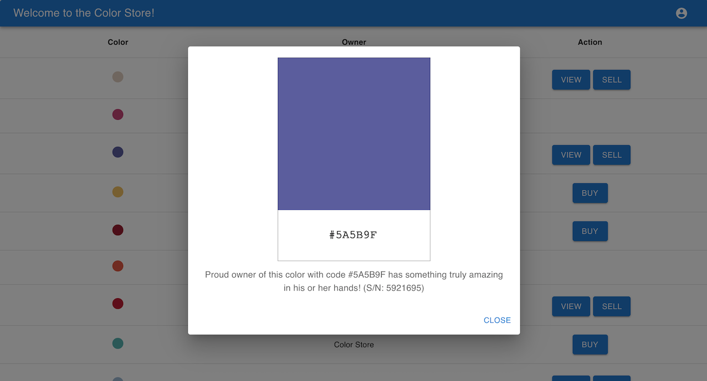
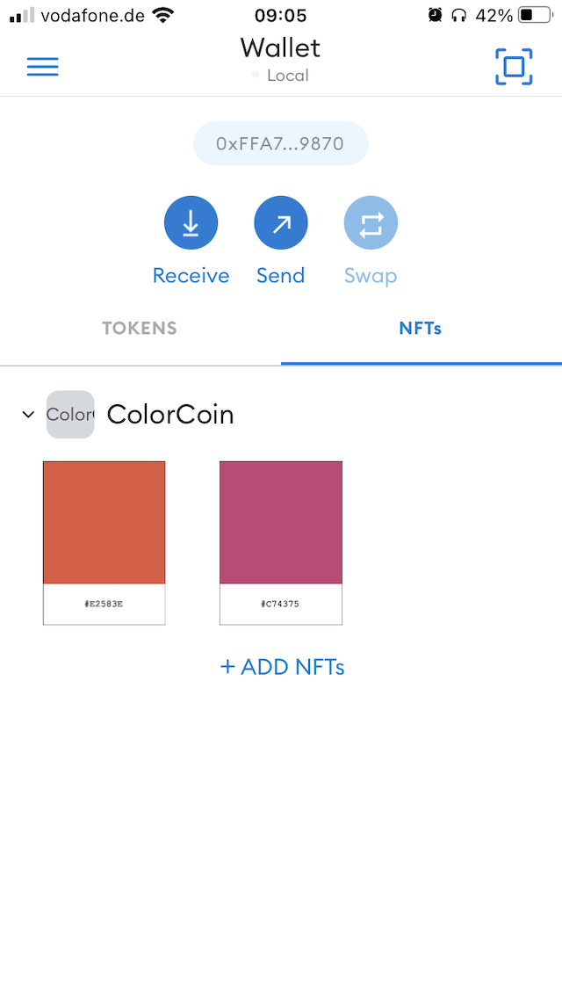

# Color Store

## About

The Color Store dapp is a market place for buying, selling and exchanging NFTs that represent different colors. This
repo consists of front-end in JS + React, back-end in Java + Spring Boot, and Solidity smart contracts for Ethereum
blockchain. Requires MetaMask wallet to interact with it.

This is just a playground project with the purpose of learning more about smart contract development.

## Dev Notes

### Dependencies

- [MetaMask](https://metamask.io/) in browser and / or mobile for interaction with the dapp

- [Ganache](https://trufflesuite.com/ganache/) for deployment of smart contracts onto personal Ethereum blockchain

- [Node.js](https://nodejs.org/), [Maven](https://maven.apache.org/) and [Truffle](https://trufflesuite.com/truffle/)

### Commands

Before launching the project, run `ifconfig` and get the network address of the host in the local network. It is
important in case MetaMask browser / wallet is used, for example, from mobile phone to access the user interface. In
case user interface and MetaMask will always be accessed from the local machine, use `127.0.0.1`. Adjust IP in following
configuration files:

- [color-store-be/src/main/resources/application.yaml](./color-store-be/src/main/resources/application.yaml)

- [color-store-contract/.env](./color-store-contract/.env)

- [color-store-fe/.env](./color-store-fe/.env)

In order to run the project:

1. Start PostgreSQL:<br />
   `docker run --name color-store-postgres -e POSTGRES_DB=color-store -e POSTGRES_PASSWORD=secret -d -p 5433:5432 postgres`

3. Start Ganache node on `http://0.0.0.0:8545`

4. Build, test and deploy Solidity smart contracts project:
    ```
    (cd color-store-contract \
        && truffle test \
        && truffle migrate --reset --network test \
        && cp build/contracts/* ../color-store-fe/src/contracts)
    ```

5. Build and run Spring Boot back-end project:<br />
   `(cd color-store-be && mvn flyway:clean flyway:migrate spring-boot:run)`

6. Build and run React front-end project (run in different shell):<br />
   `(cd color-store-fe && npm start)`

### Useful Links

- ERC-721 Non-Fungible Token Standard:<br />
  https://ethereum.org/en/developers/docs/standards/tokens/erc-721/

- Web3j: Interacting with a Node:<br />
  https://docs.web3j.io/4.8.7/getting_started/interacting_with_node/

- Web3j: Filters and Events:<br />
  http://docs.web3j.io/4.8.7/advanced/filters_and_events/

- React: Getting Started:<br />
  https://reactjs.org/docs/getting-started.html

- Material-UI:<br />
  https://mui.com/

- MetaMask Docs: Create A Simple Dapp:<br />
  https://docs.metamask.io/guide/create-dapp.html

## Screenshots

- Asset list:<br />

- Owned asset view:<br />

- Owned asset list in MetaMask:<br />

- Owned asset view in MetaMask:<br />
